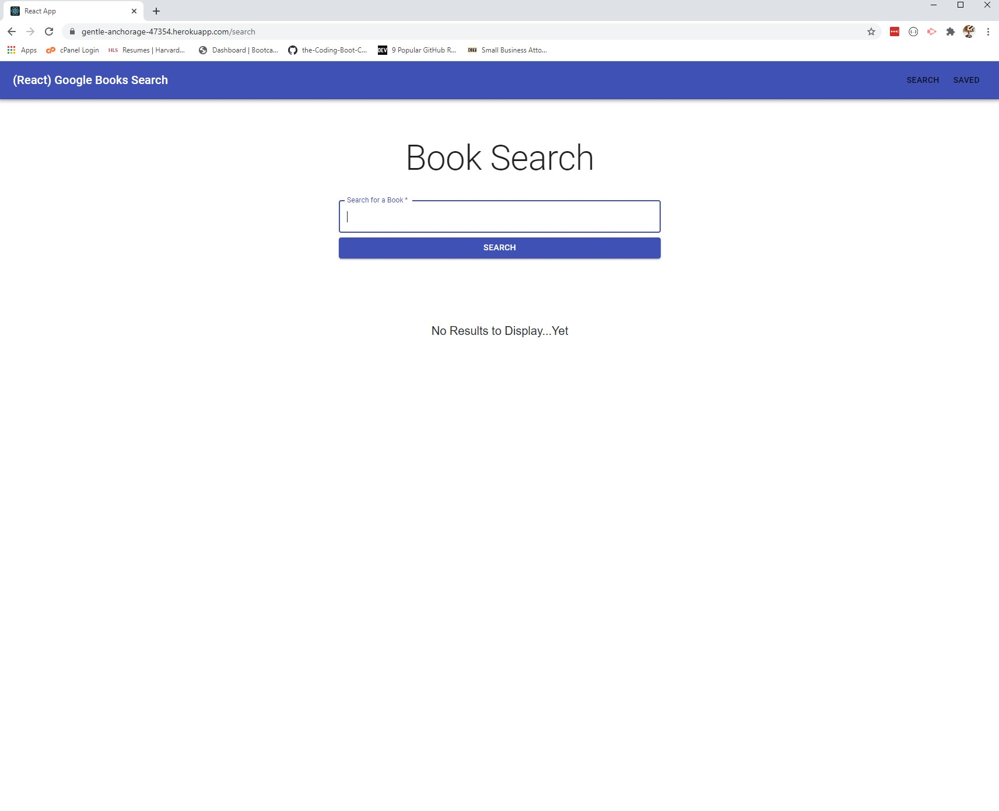

# Google Books React Search

## Project Description

This deployed web app is built with React JS and leverages the Google Books API  to allow the user to query, populate, save, and delete books.

## Table of Contents

* [Description](#project-description)
* [Table of Contents](#table-of-contents)
* [Installation](#installation-instructions)
* [Usage](#usage)
* [Contributing](#guidelines-for-contributing)
* [Tests](#tests)
* [Questions](#questions)
* [License](#license)

## Installation Instructions

If you are interested in using the Google Books React Search app, the [repo](https://github.com/jth2698/google-book-search) can be cloned.  Or, users can test the [deployed Employee Directory app](https://gentle-anchorage-47354.herokuapp.com/search).

## Usage 

[the Google Books React Search app is deployed](https://jth2698.github.io/employee-directory), and users can try out its functionality there.

## Guidelines for Contributing

Thoughts and suggestions regarding future updates for the Google Books React Search app can be e-mailed to the author below.

## Tests

Test early; test often.

## Questions

You can contact James Howard through [GitHub](https://github.com/jth2698) for any additional questions and/ or clarifications you may need about the project.

## License

[This application uses the **GNU Affero General Public License v3.0** found here](./LICENSE).